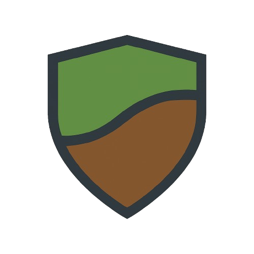

# 🌄 TerraShield - Advanced Landslide Monitoring System

<div align="center">



**Real-time landslide detection and alert system using IoT sensors and AI-powered analysis**

[](https://python.org)
[](https://streamlit.io)
[](https://flask.palletsprojects.com)
[](https://supabase.com)
[](https://twilio.com)

</div>

## 🚀 Overview

TerraShield is a comprehensive landslide monitoring system that combines IoT sensors, real-time data processing, and intelligent alert mechanisms to provide early warning for potential landslide events. The system monitors critical parameters including soil moisture, vibration, tilt, and temperature to detect dangerous conditions.

## ✨ Key Features

### 📊 **Real-time Dashboard**
- **Live Data Visualization**: Interactive charts and graphs showing sensor readings
- **Geographic Mapping**: Real-time location tracking with interactive maps
- **Multi-language Support**: English, Hindi, and Marathi interfaces
- **Auto-refresh**: Dashboard updates every 10 seconds with latest data
- **Responsive Design**: Works on desktop, tablet, and mobile devices

### 🚨 **Intelligent Alert System**
- **Multi-parameter Analysis**: Monitors moisture, vibration, tilt, and temperature
- **Threshold-based Alerts**: Configurable alert thresholds for each parameter
- **WhatsApp Integration**: Instant alerts sent via WhatsApp
- **Multi-language Alerts**: Alerts sent in user's preferred language
- **Duplicate Prevention**: Smart system prevents spam alerts

### 🌐 **Multi-language Support**
- **3 Languages**: English, Hindi, and Marathi
- **Dynamic Language Switching**: Change language without restarting
- **Localized Alerts**: All notifications in user's preferred language
- **Language Selector**: Easy-to-use language selection interface

### 🔧 **Robust Backend**
- **RESTful API**: Clean API endpoints for data access
- **Real-time Processing**: Live sensor data processing and analysis
- **Database Integration**: Supabase for reliable data storage
- **Error Handling**: Comprehensive error handling and logging

## 🏗️ System Architecture

```
┌─────────────────┐    ┌─────────────────┐    ┌─────────────────┐
│   IoT Sensors   │───▶│  Supabase DB    │───▶│  Flask Backend  │
│                 │    │                 │    │                 │
│ • Accelerometer │    │ • Sensor Data   │    │ • API Endpoints │
│ • Gyroscope     │    │ • User Prefs    │    │ • Data Processing│
│ • Moisture      │    │ • Alert History │    │ • Alert Logic   │
│ • Temperature   │    │                 │    │                 │
└─────────────────┘    └─────────────────┘    └─────────────────┘
                                                       │
                       ┌─────────────────┐            │
                       │ Streamlit UI    │◀───────────┘
                       │                 │
                       │ • Dashboard     │
                       │ • Visualizations│
                       │ • Real-time Maps│
                       │ • Multi-language│
                       └─────────────────┘
                                │
                       ┌─────────────────┐
                       │  Twilio API     │
                       │                 │
                       │ • WhatsApp SMS  │
                       │ • Multi-language│
                       │ • Alert Delivery│
                       └─────────────────┘
```

## 🛠️ Installation & Setup

### Prerequisites
- Python 3.8 or higher
- Supabase account and project
- Twilio account for WhatsApp integration
- Git

### 1. Clone the Repository
```bash
git clone <repository-url>
cd final-dashboard
```

### 2. Create Virtual Environment
```bash
python -m venv venv

# Windows
venv\Scripts\activate

# Linux/Mac
source venv/bin/activate
```

### 3. Install Dependencies
```bash
pip install -r requirements.txt
```

### 4. Environment Configuration
Create a `.env` file in the project root:

```env
# Supabase Configuration
SUPABASE_URL=your_supabase_url
SUPABASE_KEY=your_supabase_anon_key

# Twilio Configuration
TWILIO_ACCOUNT_SID=your_twilio_account_sid
TWILIO_AUTH_TOKEN=your_twilio_auth_token
TWILIO_WHATSAPP_NUMBER=whatsapp:+14155238886

# Alert Thresholds
MOISTURE_THRESHOLD=80
VIBRATION_THRESHOLD=10
TILT_THRESHOLD=10
```

### 5. Database Setup
1. Create a Supabase project
2. Create the following tables:
   - `sensor_readings` (for sensor data)
   - `user_prefs` (for user preferences)

## 🚀 Quick Start

### Option 1: Automated Startup (Recommended)
```bash
# Run both backend and frontend
python start_dashboard.py
```

### Option 2: Manual Startup
```bash
# Terminal 1 - Start Flask Backend
cd backend
python app.py

# Terminal 2 - Start Streamlit Dashboard
cd frontend
streamlit run dashboard2.py --server.port=8501
```

### Option 3: Windows Batch File
```bash
# Double-click or run
start_dashboard.bat
```

## 📱 Usage

### Dashboard Access
- **Main Dashboard**: http://localhost:8501
- **API Endpoint**: http://127.0.0.1:5000/sensor-data
- **WhatsApp Webhook**: http://127.0.0.1:5000/whatsapp

### WhatsApp Integration
1. Send any message to your configured WhatsApp number
2. Choose your preferred language (English/Hindi/Marathi)
3. Send "sensor values" to get current readings
4. Send "change language" to switch languages

### Alert Configuration
- Modify thresholds in `.env` file
- Alerts trigger when 2+ parameters exceed thresholds
- Alerts sent via WhatsApp in user's preferred language

## 📊 Dashboard Features

### Real-time Monitoring
- **Live Charts**: Interactive time-series graphs
- **Geographic Maps**: Real-time location tracking
- **Sensor Status**: Color-coded status indicators
- **Alert History**: Complete alert log with timestamps

### Data Visualization
- **Moisture Levels**: Soil moisture percentage
- **Vibration Analysis**: Gyroscope-based vibration detection
- **Tilt Monitoring**: Accelerometer-based tilt angle calculation
- **Temperature Tracking**: Environmental temperature monitoring

## 🔧 API Endpoints

### GET `/sensor-data`
Returns latest sensor readings with calculated values.

**Response:**
```json
[
  {
    "moisture": 75.5,
    "vibration": 8.2,
    "tilt": 12.3,
    "temperature": 24.1,
    "timestamp": "2024-01-15T10:30:00Z"
  }
]
```

### POST `/whatsapp`
Handles incoming WhatsApp messages for language selection and data requests.

## 🌍 Multi-language Support

The system supports three languages with complete localization:

- **English** (Default)
- **Hindi** (हिंदी)
- **Marathi** (मराठी)

All alerts, messages, and interface elements are translated and contextually appropriate.

## 🔒 Security Features

- **Environment Variables**: Sensitive data stored in `.env`
- **Input Validation**: All inputs validated and sanitized
- **Error Handling**: Comprehensive error handling prevents crashes
- **Rate Limiting**: Built-in protection against spam

## 📈 Monitoring & Alerts

### Alert Conditions
Alerts are triggered when **2 or more** of the following thresholds are exceeded:
- **Moisture**: > 80%
- **Vibration**: > 10g
- **Tilt**: > 10°

### Alert Features
- **Instant Delivery**: Real-time WhatsApp notifications
- **Multi-language**: Alerts in user's preferred language
- **Duplicate Prevention**: Smart system prevents spam
- **Rich Context**: Includes location, timestamp, and sensor values

## 🛠️ Development

### Project Structure
```
final-dashboard/
├── backend/
│   ├── app.py              # Flask API server
│   ├── alerts.py           # Alert processing logic
│   ├── messages.py         # Multi-language messages
│   ├── models.py           # Data models
│   └── database.py         # Database utilities
├── frontend/
│   ├── dashboard2.py       # Main Streamlit dashboard
│   ├── sensor_alert_monitor.py  # Alert monitoring system
│   ├── language_selector.py     # Language selection UI
│   └── images/             # Dashboard assets
├── start_dashboard.py      # Automated startup script
├── start_dashboard.bat     # Windows batch file
└── requirements.txt        # Python dependencies
```

### Adding New Features
1. **New Sensors**: Add to `sensor_readings` table and update processing logic
2. **New Languages**: Add translations to `messages.py`
3. **New Alert Types**: Extend `alerts.py` with new conditions
4. **UI Components**: Add new Streamlit components to `dashboard2.py`

## 🤝 Contributing

1. Fork the repository
2. Create a feature branch (`git checkout -b feature/amazing-feature`)
3. Commit your changes (`git commit -m 'Add amazing feature'`)
4. Push to the branch (`git push origin feature/amazing-feature`)
5. Open a Pull Request

## 📝 License

This project is licensed under the MIT License - see the [LICENSE](LICENSE) file for details.

## 🆘 Support

For support and questions:
- Create an issue in the repository
- Check the documentation
- Review the code comments

## 🙏 Acknowledgments

- **Streamlit** for the amazing dashboard framework
- **Supabase** for the reliable database service
- **Twilio** for WhatsApp integration
- **Plotly** for interactive visualizations
- **Folium** for mapping capabilities

---

<div align="center">

**Made with ❤️ for landslide prevention and community safety**

[](https://github.com/fil0st1/terrashield)
[](https://github.com/fil0st1/terrashield)

</div>
